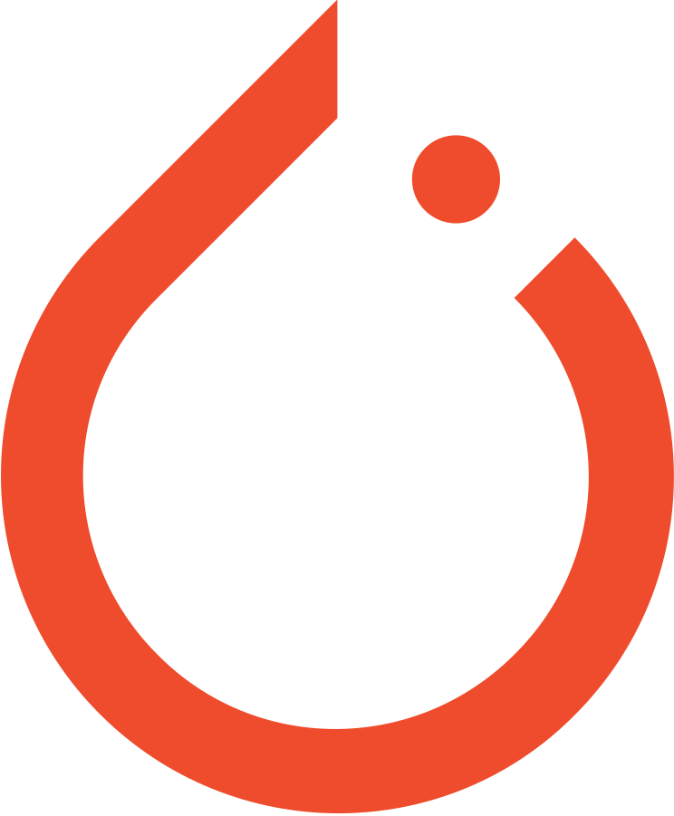

<h1 align="center">
  Hi, I am Guo Yong 👋🏼
</h1>

```javascript
const GuoYong = {
    pronouns: "He" | "Him",
    specialisation: "Software Development/Data Science",
    currentFocus: "Hybrid recommendation system",
    goal: "Insights and decisions driven by the combination of software and data science"
};
```
<h2>Connect with Me</h2>
<p>
  <a href="https://www.linkedin.com/in/tioguoyong42/">
    
  </a>
</p>

<h2>Technology Experience</h2>
<table align="center">
  <tr align="center">
    <th>Type</th>
    <th>Software/Language</th>
    <th>Frameworks/Libraries</th>
  </tr>
  
  <tr align="center">
    <td>Web Development</td>
    <td>
      
      
           </td>
    <td>
      
      
      
             </td>
  </tr>
  
  <tr align="center">
    <td>Data Science/AI</td>
    <td>
      	
      
    </td>
    <td>
      
      
      
      
    </td>
  </tr>

  <tr align="center">
    <td>Database</td>
    <td>
      
    </td>
    <td>
      -
    </td>
  </tr>

  <tr align="center">
    <td>Software Workflow</td>
    <td>
      
          
    </td>
    <td>
      -
    </td>
  </tr>
	
  <tr align="center">
    <td>General</td>
    <td>
       
       
    </td>
    <td>
      -
    </td>
  </tr>
  
  <tr align="center">
    <td>UI Prototyping</td>
    <td>
	
    </td>
    <td>
      -
    </td>
  </tr>
  
</table>

<p align="center">

</p>

<p align="center">
  
</p>

<h2>List of Completed Projects</h2>

<h3>
   Software Engineering
</h3>

<p align="center">
  <a href="https://github.com/YoNG-Zaii/OpenJIO_Fivver"></a>
</p>

<h3>
   Data Science
</h3>

<p align="center">
  <a href="https://github.com/YoNG-Zaii/MH3511-FIFA-Analysis"></a>
  <a href="https://github.com/YoNG-Zaii/Singapore-COVID-19-Daily-Cases"></a>
</p>

<h3>
  Artificial Intelligence/Machine Learning
</h3>

<p align="center">
  <a href="https://github.com/YoNG-Zaii/Casting-Products-Defects-Detection"></a>
  <a href="https://github.com/YoNG-Zaii/Cuisine-Recommender-System"></a>
  <a href="https://github.com/YoNG-Zaii/Luminos"></a>
  <a href="https://github.com/YoNG-Zaii/COVID-19-Detection-using-CNN"></a>
  <a href="https://github.com/YoNG-Zaii/Stock-Market-Forecast-using-Stacked-LSTM"></a>
</p>

<p align="center">
  
</p>
